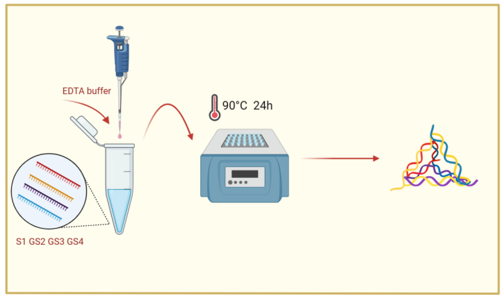
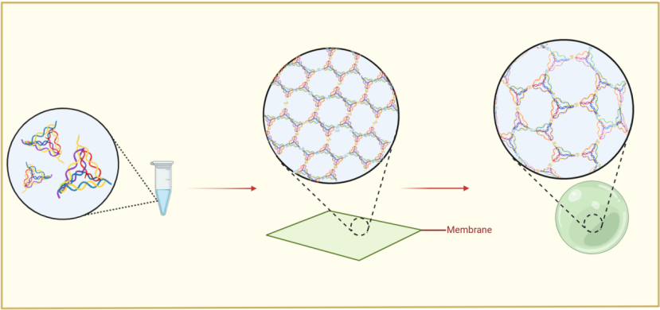

# Materials and Methods

 

### Material preparation

##### **Assembly of DNA tetrahedron** :

​	Mix S1,GS2,GS3 and GS4 in equal parts. After annealing in a metal bath for 24h, we can acquire a DNA tetrahedron. (See Figure 1 for the detailed procedure.)

###### *Fig.1: The synthesis of the DNA tetrahedron*

---

##### Assembly of DNA supramolecular :  

​	Mix the solution of DNA tetrahedron with the corresponding ion solution in a 1:1 ratio.(See Figure 2 for the detailed procedure.)

###### *Fig. 2: The synthesis of DNA supramolecular*

---

### Material characterization

 

##### 1. Agarose Gel Electrophoresis :

​	Take 3.1 μL of the DNA sample, then add 2 μL of 6 × DNA loading buffer and 4.9 μL of DEPC water, and mix well. Load the mixture into the wells of a pre-prepared agarose gel. Use 0.5 × TBE buffer as the electrophoresis buffer and run the electrophoresis at 80 V for 70 minutes.

 

##### 2. Observing by Transmission Electron Microscope :

​	The preparation of unstained samples involves treating copper grids with a plasma cleaner for 15 seconds, followed by dropping 1.5 μL sample onto the grids and leaving them to dry. The samples are imaged with a TEM operating at 200 kV.

 

##### 3. Atomic force microscopy characterization :

​	Treat the mica sheets with a smooth surface with a 10 μM nickel chloride solution for 3 minutes, then wash off the residual solution with ultrapure water. Pipette 10 μL of the DNA sample, and evenly drop it onto the treated mica sheet. After standing for 8 minutes, rinse it with ultrapure water 5 times, and gently dry it with a nitrogen blower. In atomic force microscopy, select the tapping mode in gas phase for testing.

 

##### 4. Dynamic light scattering :

​	Transfer 20 µL of the test solution into a 1.5 mL EP tube, and dilute with distilled water to 1000 µL. After mixing evenly, all samples are transferred into Malvern Glass Cuvettes and loaded into the Nanoparticle Size and Zeta Potential Analyzer. Scan time 30 seconds 3 times, then start testing.

 

##### 5. Circle dichromatography :

​	In this study, a circular dichroism spectrometer was used to obtain the circular dichroism spectral data of DNA. The optical path length of the sample cell in the experiment was 1 mm, and the concentration of DNA used in the CD experiments was 2 μM for all samples. For each sample, the instrument recorded spectral values in the range of 200~400 nm. The reference for each sample was a solution containing the corresponding salt but without DNA.

 

 

### Experimental materials

#### 	 	Table.1 :  Experimental materials

| Category                           | Cat. NO.      | Mfrs                                          |
| ---------------------------------- | ------------- | --------------------------------------------- |
| DNA Oligo                          |               | Beijing Liuhe Huada Gene Technology Co., Ltd. |
| Lithium chloride solution          | R30508-100ml  | Yuanye                                        |
| DEPC water(DNase、RNase free)      | B501005-0500  | Sangon Biotech                                |
| SYBR Safe nucleic acid dye         | A616699-0100  | Sangon Biotech                                |
| DNA Marker (50~1031 bp)            | B500345-0050  | Sangon Biotech                                |
| DNA Marker（500~15000 bp）         | B500353-0500  | Sangon Biotech                                |
| 5X TBE buffer                      | B548102-0500  | Sangon Biotech                                |
| 2M potassium chloride              | ST340         | Beyotime Biotechnology                        |
| 1M magnesium chloride              | ST269         | Beyotime Biotechnology                        |
| Red fluorescent DNA loading buffer | D0076         | Beyotime Biotechnology                        |
| 18-crown 6-ether                   | C105797-5g    | Aladdin                                       |
| 6X DNA Loading Buffer (Tricolor)   | C767005-2×1ml | Aladdin                                       |
| Anhydrous ethanol                  | E111992-500ml | Aladdin                                       |
| 10 × T4 DNA ligase buffer          | B0202S        | New England Biolabs                           |
| TE buffer, 10X, pH 8.0             | T885254       | Macklin                                       |
| Agarose                            | BS081-100g    | Biosharp                                      |

#### 		Table.2 :  Equipments

| Category                                      | Cat. NO.          | Mfrs                 |
| --------------------------------------------- | ----------------- | -------------------- |
| Transmission electron microscopy              | JEM-2100F         | JEOL                 |
| Transmission electron microscopy              | H800              | HITACHI              |
| Transmission electron microscopy              | JEM-F200          | JEOL                 |
| Atomic force microscopy                       | Cypher ES         | Oxford Instruments   |
| Nanoparticle Size and Zeta Potential Analyzer | NS-90Z            | OMEC                 |
| Thermal cycler                                | A-100             | LongGene             |
| Circular dichromatograph                      | Chirascan-plus    | Applied Photophysics |
| Vortex oscillator                             | MTV-1             | Allsheng             |
| centrifuge                                    | Centrifuge 5810 R | Eppendorf            |
| centrifuge                                    | D1012U            | DLAB                 |
| electrophoresis                               | EPS 300           | Tanon                |
| Plasma instrument                             | PDC-002           | HARRICK              |

#### Table.3 :  DNA sequence

| Id   | Description | Sequence 5’ - 3’                                             |
| ---- | ----------- | ------------------------------------------------------------ |
| 1    | RDT-A1-G4   | AATCGACAGGAACAGCAATGAACTAGCCATAGTCAATACACACCTCTAGACTTCAGATGAGAGCACTGACCCTCAGGTACCGTGGGGAATGGGG |
| 2    | RDT-A2      | CGGACTCGGACGTCTTGCGAGGTCATCTGAAGTCTAGAGGTGTGACAAAGTAACTGAATCTAACGACCAGATAAGGAACTCA |
| 3    | RDT-A3      | GTCAGTGCTCCCTCGCAAGACGTCCGAGTCCGAACATACAGTAGAGCTGGACACAACAGAAGATCCATTGCGGTACCTGAGG |
| 4    | RDT-B1-G4   | GGGGAATGGGGTTATTGACTATGGCTAGTTCATTGCTGTTCCTGTCGATTGACCTCTACGCGGCAGAGTCCACTGAGTGAGATCCGCACGTTGA |
| 5    | RDT-B2      | TCTCACTCAGTATACTTCCAGATCAATGTCTAGACGTCGTTCATCTCGAGAGCTGTAACCAATGTAATTTTCAACGTGCGGA |
| 6    | RDT-B3      | TAGACATTGATCTGGAAGTATATGGACTCTGCCGCGTAGAGGTCTCAAGAGTTAGGAATATCCCTGGAAAGGTTACACATCG |
| 7    | RDT-C1-G4   | GGGGAATGGGGTCTAGACCTATGTACCTATGTACCGCCGACTACGAACTGCTTGGTCAATGGATCTTCTGTTGTGTCCAGCTCTACTGTATGTT |
| 8    | RDT-C2      | GTGAGTGCTAGTACATAGGTACATAGGTCTAGCGTACTGGTCACGGTTCACCATCGCTCGTATAGGCCATGTCCACATGCTC |
| 9    | RDT-C3      | GTAGTCGGCGTAGCACTCACGAGCATGTGGACCGATGTGTAACCTTTCCAGGGATATTCCTAACTCTTGAACCAAGCAGTTC |
| 10   | RDT-D1-S1   | TTAGAACATTCCATGTGCTATTTTTACCGTATGCGTACCCATTTATTACATTGGTTACAGCTCTCGAGATGAACGACGTCTTTCTAGTAATTGGCCT |
| 11   | RDT-D2      | TTTTGGGTACGCATACGGTATTTTTCGCTTACTGCCAATCGGTTAGAGTTCCTTATCTGGTCGTTAGATTCAGTTACTTTGT |
| 12   | RDT-D3      | TTCCGATTGGCAGTAAGCGTTTTTTAGCACATGGAATGTTCTATGGCCTATACGAGCGATGGTGAACCGTGACCAGTACGTT |
| 13   | RDT-B1      | TATTGACTATGGCTAGTTCATTGCTGTTCCTGTCGATTGACCTCTACGCGGCAGAGTCCACTGAGTGAGATCCGCACGTTGA |
| 14   | RDT-C1      | CTAGACCTATGTACCTATGTACCGCCGACTACGAACTGCTTGGTCAATGGATCTTCTGTTGTGTCCAGCTCTACTGTATGTT |
| 15   | RDT-C2      | GTCCACATGCTCGTGAGTGCTAGTACATAGGTACATAGGTCTAGCGTACTGGTCACGGTTCACCATCGCTCGTATAGGCCAT |
| 16   | S1          | ATGCAACTGTTCAACTCGCTCGTAACTACACTGTGCAATACTCTGGTGACC          |
| 17   | GS2         | GGGGAATGGGGTTCTGACGTAGTGTATGCACAGTGTAGTAAGGACCCTCGCAT        |
| 18   | GS3         | GGGGAATGGGGTACGAGCGAGTTGATGTGATGCAAGCTGAATGCGAGGGTCCT        |
| 19   | GS4         | GGGGAATGGGGTACACTACGTCAGAACAGCTTGCATCACTGGTCACCAGAGTA        |
