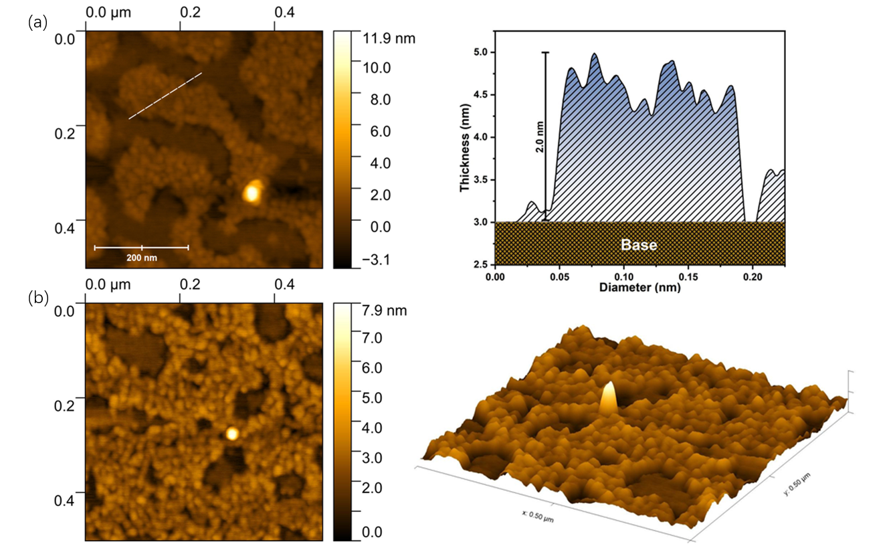
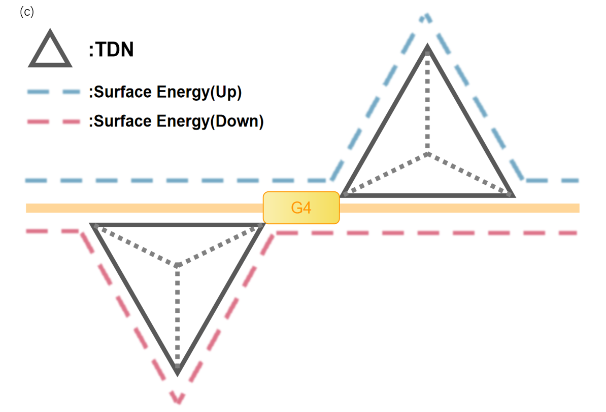
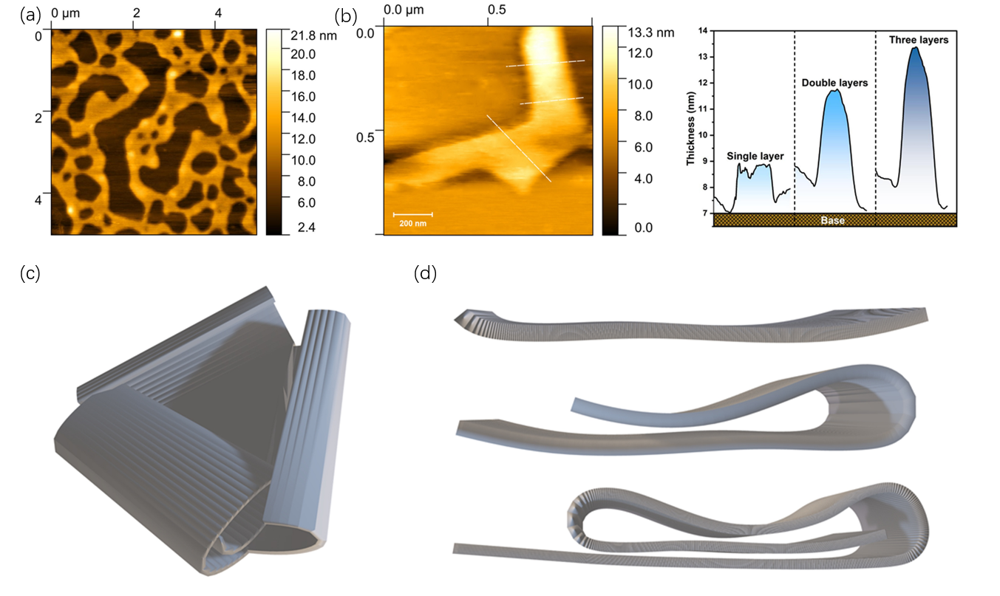
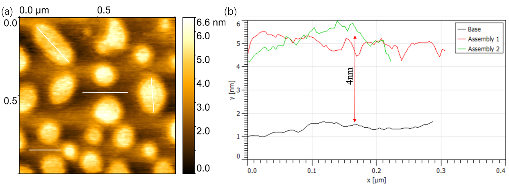
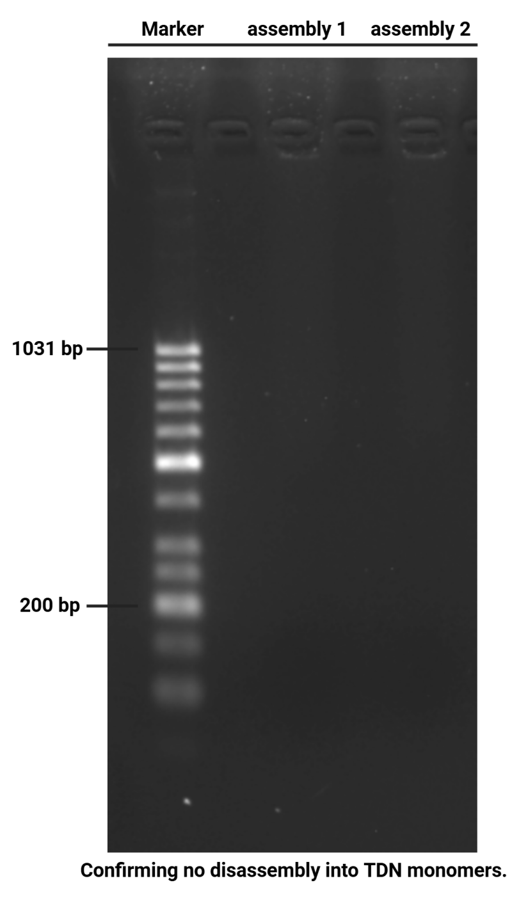

# **Results and Discussion**

​	This study focuses on investigating how to use DNA tetrahedra as monomers and ion responsive G4 chains as linkers to achieve template-free synthesis of two-dimensional membranes and cage structures by controlling reaction conditions.

​	Initially, three DNA single strands (GS2-GS4) with G-rich terminals and an additional strand (S1) containing potential functional modification sites were subjected to annealing to form DNA tetrahedrons (TDNs)[1]. Subsequently, by introducing different cations, single layer membrane structure and cage assembly was directly achieved in template-free solution. The entire assembly process was characterized using agarose gel electrophoresis (AGE) and dynamic light scattering (DLS). Meanwhile, atomic force microscopy (AFM) and transmission electron microscopy (TEM) were employed to visualize the structure of the assemblies.

​	All experimental evidence confirms the successful development of a strategy for direct 2D DNA membrane assembly in solution using rigid linkers, enabling the synthesis of supramolecular assemblies with sizes exceeding 100 nm. Furthermore, by adjusting the ion ratio, the 2D membrane assembly was successfully curved, and spherical cage structures with a diameter of over 200 nm were synthesized in a substrate-free solution. Owing to the ion dependence of G4 chains, the membrane assembly can undergo rapid dissociation upon the addition of a small amount of the counter molecule 18-crown-6 ether. Under such conditions, reversible assembly can be realized under mild conditions. Additionally, due to the presence of functional group chains reserved at the vertices of the TDN tetrahedron, this assembly can be rapidly modified and loaded with a large number of different functional groups, laying the foundation for its further expanded applications.

### **1. Synthesis of TDN Monomers**

​	TDN monomers were assembled via one-step annealing in solution[1,2], and the assembly details were analyzed by AGE. As shown in Fig. 1, from left to right in the gel, with the sequential addition of each nucleic acid strand, the migration rate of the assemblies gradually decreased, eventually stabilizing at approximately 180 bp (referenced to the nucleic acid marker). The faster migration rate (compared to the actual base length of 210 bp) can be attributed to the reduced overall radius of the constrained nucleic acid strands after assembly, which is consistent with observations reported in other similar studies[3].

*Fig.1: 3% agarose gel electrophoresis image of various nucleic acid units after annealing under experimental conditions, stained with Safe Green nucleic acid dye. Lanes 1-4: S1 single strand, GS2 single strand, GS3 single strand, GS4 single strand; Lanes 5-8: S1+GS2 assembly, GS2+GS3 assembly, S1+GS2+GS3 assembly, GS2+GS3+GS4 assembly; Lanes 9-10: Two parallel batches of synthesized TDN assemblies; Lane 11: 50-1031 bp DNA marker.* 

---

​	Subsequently, AFM was used to characterize the structure of the synthesized TDN monomers. As presented in Fig. 2a-b , the TDN structures appeared as particles with a diameter ranging from 15 to 25 nm and a thickness of approximately 1 nm in the AFM images. The deviated aspect ratio (0.04 instead of 1.0 for an ideal regular tetrahedron) is attributed to two factors: the dehydration-induced collapse of the 3D structure during sample preparation and the damage to the Z-direction structure caused by the tapping-mode probe during testing1 .A small number of larger aggregates observed may result from random TDN aggregation induced by a high Mg²+ concentration, while particles smaller than the aforementioned diameter are considered to be a small amount of unassembled strand clusters. The overall assembly efficiency was statistically analyzed through particle size measurement (Fig. 2b). Using the built-in program of AFM to count the particle sizes of monomers, the TDN particle sizes exhibited a Gaussian distribution, with an average diameter of 19 ± 1 nm. The small standard deviation indicates that the assembly conditions were successfully optimized.

 

*Fig.2: (a) Statistical analysis of the particle sizes of assembled TDN monomers. (b) Cross-sectional analysis of the AFM image of TDN monomers*

---

 

 

### **2. Synthesis of Supramolecular Assemblies**

​	Next, different cations were introduced to trigger the G4 quadruplex-mediated directional assembly of TDNs.

​	G4 quadruplexes exhibit broad cation dependence and can be stabilized by various cations, such as K+, Na+, Li+, and NH4+. Among these cations, K+ exhibits a much stronger stabilizing effect on G4 quadruplexes than the others. This is due to its suitable ionic radius and low dehydration energy[4], which can be verified by theoretical calculations of its melting temperature and binding energy[6]. However, the high binding strength of K+ introduces drawbacks during assembly: the dissociation temperature of its complexes is much higher than the disassembly temperature of TDNs, making structural reorganization and local error correction unattainable via conventional cooling-annealing methods. This assembly method typically results in randomly aggregated clumpy structures. To address this issue, lithium ion , a cation with weaker binding strength, was introduced for auxiliary assembly. Compared to K+ , Li+ has lower binding strength and a moderate melting temperature, enabling mild reversible dissociation without damaging TDN monomers. The difference in binding energy between these two ions not only leads to variations in the structural rigidities of the assemblies but also expands the range of synthesized assemblies (Fig. 3a, 5a, 6a).

​	To investigate the fine structure of the assemblies, AFM, TEM, and DLS were utilized. Conventional AGE was not employed for analysis except in the section related to deionized disassembly (④). This is because the excessively large size of the assemblies (usually > 100 nm) and the high ion concentration in the electrophoresis buffer would cause damage to the agarose gel.

**①** **TDN assembly induced by Li+**

​	A series of Li+-induced assemblies were successfully synthesized by simply adding Li+-containing buffer to the TDN monomer solution and equilibrating the mixture near its melting temperature for 48 h.

*Fig.3  (a) AFM images of Li+-induced assemblies.  Cross-sectional analysis of the AFM image of Li+-induced assemblies. (b)AFM images of Li+-induced assemblies. 3D AFM image of Li+-induced assemblies. (c) TDN monomer assembly conformation diagram*

---

​	As shown in the AFM images, the Li+-induced assemblies form continuous membrane structures with a thickness of approximately 2 nm and a diameter of around 200 nm. After optimizing the testing conditions, clumpy structures with a diameter of approximately 20 nm were clearly observed. Combining the size of TDN monomers and the uniform thickness of the overall assembly, this assembly was identified as a 2D membrane structure formed by the assembly of single-layer TDNs.

​	In the cross-sectional profile, numerous spike-like structures were clearly observed on the membrane surface(Fig.3c). These structures are considered to be the tetrahedral tips of TDN monomers, further confirming that the membrane structure is formed by the directional assembly of TDNs rather than the random aggregation of nucleic acids driven by surface tension.

Due to the presence of surface energy and electrostatic repulsion of the nucleic acid backbone[6], TDNs tend to assemble in a configuration where their tetrahedral tips face opposite directions during 2D membrane formation(Fig.3c). This explains why the observed structure thickness is 2 nm instead of the ideal 1 nm for a single layer.

 

**②** **TDN Assembly Induced by K+**

​	K+-induced assemblies were synthesized using the same preparation method as that for Li+-induced assemblies. Notably, although the melting temperature of G4 quadruplexes stabilized by K+ is much higher than the equilibrium temperature (70°C >> 35°C) under these conditions, the same annealing procedure was maintained to ensure a consistent thermodynamic environment for the system.

*Fig.4: (a) AFM images of K+-induced assemblies. (b)Cross-sectional analysis of the AFM images of K+-induced assemblies. (c)3D model of membrane stacking structure* (d)3D models with different numbers of stacked layers.

---

​	AFM characterization of K+-induced assemblies revealed large-area assembly structures. Compared to Li+-induced assemblies, the intact area of K+-induced assemblies was significantly increased, and the number of internal voids was greatly reduced. Only large-scale stress-induced holes caused by drying during sample preparation were observed, indicating a lower defect rate during assembly. This phenomenon corresponds to the stronger stabilizing effect of K+ on G4 quadruplexes.

​	To study the structure of K+-induced assemblies more precisely, higher-resolution AFM images were acquired and subjected to cross-sectional analysis. Interestingly, three membrane structures with different thicknesses (2 nm, 4 nm, and 6 nm) were observed(Fig.5b-c). This fixed thickness gradient typically indicates the presence of multi-layer stacking in the system[7]. Combined with the AFM image feature that the edge thickness is larger than the internal thickness of the intact membrane, this thickness gradient is attributed to membrane curling and multi-layer stacking caused by drying during sample preparation. The unique thickness gradient (2 nm = 2 × TDN thickness) further confirms that, similar to Li+-induced assemblies(Fig. 3b), this membrane structure is a 2D membrane formed by TDN assembly.

 

 **③** **Synergistic Assembly Induced by K+ and Li+**

​	Subsequently, a mixed solution of K+ and Li+ was used to prepare K+ /Li+ -induced assembly structures.

*Fig.5 (a) AFM image of K+/Li+-induced assemblies. (b) 3D AFM image of K+/Li+-induced assemblies. (c) Statistical analysis of the particle sizes of K+ /Li+ -induced assemblies from AFM images. (d) DLS data of K+/Li+-induced assemblies.*

---

​	In the AFM images of K+ /Li+ -induced assemblies, a large number of spherical structures were observed, with a small number of ellipsoidal structures interspersed. These ellipsoidal assemblies may be formed by the fusion of adjacent spherical structures. The uniform thickness observed in the 3D images indicates that these spherical structures are not irregular DNA clusters, as the latter generally exhibit a strong thickness-diameter correlation[8]—a phenomenon not observed in our images.

​	To further confirm whether these spherical structures are self-assembled in solution or formed by surface tension during drying, DLS was performed to verify the presence of such structures in solution(Fig. 6d). 

 

*Fig.6: Phase diagram analysis of the AFM images of K+/Li+-induced assemblies.*

---

​	To further investigate the internal structure of the spherical structures, the phase diagrams of the AFM images of the spherical structures were analyzed, and the mechanical properties were used to characterize the spheres. The phase diagrams showed a soft-hard-soft transition inside the spherical structures. Combining height images and phase diagrams for analysis, this transition indicates the presence of a cap-like structure inside the spheres formed by dehydration-induced collapse. This structure is commonly observed in liposome vesicles of similar size, providing further evidence that the spherical structures are hollow[10].

 

*Fig.7: Cross-sectional analysis of the AFM images of K+ /Li+ -induced assemblies.*

---

​	To further confirm that the spherical structures are hollow spherical cages, higher-resolution AFM images were used to analyze the cross-sectional structure of the spheres(Fig. 8). Consistent with the expected results, the cross-section of the spheres showed a uniform thickness, which is exactly equal to the superimposed thickness of the two-layer TDN membrane discussed earlier(2 × 2 nm = 4 nm).

​	In summary, we have ultimately confirmed the successful use of TDN as a structural monomer and G4 chains as connectors to synthesize assemblies such as hollow cages and two-dimensional membranes.

 

**④** **Reversibility of G4 Quadruplex-Mediated Assembly**

 

​	In order to prove that we can control the linking of G4 chains and the formation of assemblies by means of ion concentration, agarose gel electrophoresis was used to analyze the assembly and the disassembly process induced by deionization.18-crown-6 ether is a type of crown ether with a cavity. Its appropriately sized cavity and numerous oxygen coordination sites endow it with extremely high affinity for K+ ions, and it is used to remove K+ ions from buffers and assemblies[11].

*Fig. 8: Agarose gel electrophoresis image of K+-induced assemblies stained with Safe Green nucleic acid dye. From left to right, Lane 1: 50-1031 bp DNA marker; Lanes 2-3: K⁺-induced assemblies.*

---

​	It can be seen that in the presence of K+ ions, the assemblies can be successfully assembled and remain stable under electrophoresis conditions. Due to the large average radius of the assemblies (>200 nm), severe pore-blocking occurred in the electrophoresis lanes, making it almost impossible to find any signal at the corresponding positions.

*Fig. 9: Agarose gel electrophoresis image of the disassembly of K⁺-induced assemblies induced by crown ether. The image was captured after staining with Safe Green nucleic acid dye. From left to right, Lane 1: TDN monomers; Lanes 2-3: Assemblies undergoing disassembly induced by 18-crown-6 ether; Lane 4: 50-1031 bp DNA marker.*

---

​	In contrast, upon the addition of 18-crown-6 ether, the competitive binding of this crown ether to K+ ions triggers the disassembly of the assemblies under the same experimental conditions. Consequently, a positive signal emerges at a position nearly coinciding with that of the TDN monomers. This unique property of the assemblies establishes a foundational basis for their rapid adjustment and adaptation in the context of complex and dynamically changing biological microenvironments. Notably, such behavior endows the assemblies with a high level of dynamism, which significantly surpasses that of the conventional double-strand-linked DNA supramolecular structures.

### **Reference**

(1)  Zhou, Z.; Fan, D.; Wang, J.; Sohn, Y. S.; Nechushtai, R.; Willner, I. Triggered Dimerization and Trimerization of DNA Tetrahedra for Multiplexed miRNA Detection and Imaging of Cancer Cells. *Small* **2021**, *17* (6), 2007355. https://doi.org/10.1002/smll.202007355.

(2)  Guo, Y.; Zhang, Q.; Zhu, Q.; Gao, J.; Zhu, X.; Yu, H.; Li, Y.; Zhang, C. Copackaging Photosensitizer and PD-L1 siRNA in a Nucleic Acid Nanogel for Synergistic Cancer Photoimmunotherapy. *Sci. Adv.* **2022**, *8* (16), eabn2941. https://doi.org/10.1126/sciadv.abn2941.

(3)  Ke, Y.; Sharma, J.; Liu, M.; Jahn, K.; Liu, Y.; Yan, H. Scaffolded DNA Origami of a DNA Tetrahedron Molecular Cage.

(4)  Zaccaria, F.; Paragi, G.; Fonseca Guerra, C. The Role of Alkali Metal Cations in the Stabilization of Guanine Quadruplexes: Why K+ Is the Best. *Phys. Chem. Chem. Phys.* **2016**, *18* (31), 20895–20904. https://doi.org/10.1039/C6CP01030J.

(5)  Lane, A. N.; Chaires, J. B.; Gray, R. D.; Trent, J. O. Stability and Kinetics of G-Quadruplex Structures. *Nucleic Acids Research* **2008**, *36* (17), 5482–5515. https://doi.org/10.1093/nar/gkn517.

(6)  Vieregg, J. R. Nucleic Acid Structural Energetics.

(7)  Baek, K.; Yun, G.; Kim, Y.; Kim, D.; Hota, R.; Hwang, I.; Xu, D.; Ko, Y. H.; Gu, G. H.; Suh, J. H.; Park, C. G.; Sung, B. J.; Kim, K. Free-Standing, Single-Monomer-Thick Two-Dimensional Polymers through Covalent Self-Assembly in Solution. *J. Am. Chem. Soc.* **2013**, *135* (17), 6523–6528. https://doi.org/10.1021/ja4002019.

(8)  Rizvi, A.; Mulvey, J. T.; Carpenter, B. P.; Talosig, R.; Patterson, J. P. A Close Look at Molecular Self-Assembly with the Transmission Electron Microscope. *Chem. Rev.* **2021**, *121* (22), 14232–14280. https://doi.org/10.1021/acs.chemrev.1c00189.

(9)  Farkas, N.; Kramar, J. A. Dynamic Light Scattering Distributions by Any Means. *J Nanopart Res* **2021**, *23* (5), 120. https://doi.org/10.1007/s11051-021-05220-6.

(10) Richter, R.; Mukhopadhyay, A.; Brisson, A. Pathways of Lipid Vesicle Deposition on Solid Surfaces: A Combined QCM-D and AFM Study. *Biophysical Journal* **2003**, *85* (5), 3035–3047. https://doi.org/10.1016/S0006-3495(03)74722-5.

(11) Dong, J.; O’Hagan, M. P.; Willner, I. Switchable and Dynamic G-Quadruplexes and Their Applications. *Chem. Soc. Rev.* **2022**, *51* (17), 7631–7661. https://doi.org/10.1039/D2CS00317A.